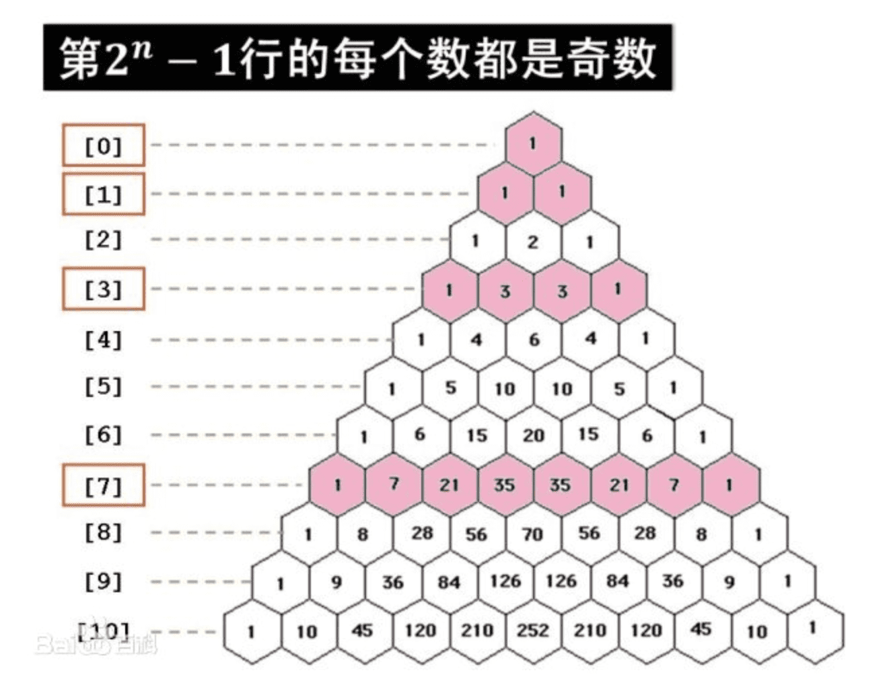

# 2020 牛客国庆集训派对 Day2

???+ info "Contents"
    [TOC]

## Contest Info

[Practice Link](https://ac.nowcoder.com/acm/contest/7818)

| Solved |   A   |   B   |   C   |   D   |   E   |   F   |   G   |   H   |   I   |   J   |
| :----: | :---: | :---: | :---: | :---: | :---: | :---: | :---: | :---: | :---: | :---: |
| 10/10  |   O   |   O   |   O   |   O   |   O   |   O   |   O   |   O   |   Ø   |   O   |

* O    在比赛中通过
* Ø    赛后通过
* !    尝试了但是失败了
* \-   没有尝试

## Solutions

### Problem A. AKU NEGARAKU

Solved By Dup4. 00:20(+1)

#### 题意

给出 $n$ 个数，并且是 $[1, n]$ 的一个排列，并且是升序的。

这 $n$ 个数形成一个环，第一次第 $m$ 个数先出来，然后往下轮 $m$ 个位置的数出来，然后往下轮 $m$ 个位置的数出来。

问最后出来的那个数是多少？

#### 思路

暴力模拟就没了。

??? info "Code"
    ```cpp
    ---8<--
    2020/nowcoder-national-day-training-party/day2/solutions/a.cpp
    ---8<--
    ```

### Problem B. CHEAP DELIVERIES

Solved By Dup4. 03:11(+2)

#### 题意

有 $n$ 个点 $m$ 条边的无向图，有 $k$ 躺运输需求，起点为 $f_i$，终点为 $d_i$，结束一趟需求后才能开启下一趟需求。

问解决所有需要最少需要多少时间？

#### 思路

先对每个需求的起点和终点作为起点跑最短路。

然后状态压缩 DP 即可。

??? info "Code"
    ```cpp
    ---8<--
    2020/nowcoder-national-day-training-party/day2/solutions/b.cpp
    ---8<--
    ```

### Problem C. ELI'S CURIOUS MIND

Solved By Dup4. 01:23(+)

#### 题意

给出一个 $n$，问有多少个满足条件的子集？

怎样算满足条件？

* 集合中的任意两个数不相邻。
* 集合中不能再添加任意一个 $[1, n]$ 内的数，并且该集合仍然满足第一个条件。

#### 思路

* 考虑 $f[i]$ 表示最大的那个数是 $i$ 并且满足第一个条件的集合数量。
* 那么对于 $n$，它的答案就是 $f[n] + f[n - 1]$。
* 考虑 $f[i]$ 如何递推？
    * 首先它可以在 $f[i - 2]$ 的基础上加上 $i$，仍然满足第一个条件。
    * 其次它可以在 $f[i - 3]$ 的基础上加上 $i$，仍然满足第一个条件。

??? info "Code"
    ```cpp
    ---8<--
    2020/nowcoder-national-day-training-party/day2/solutions/c.cpp
    ---8<--
    ```

### Problem D. EXPLORACE

Solved By Dup4. 00:55(+)

#### 题意

题意没读懂，感觉就是求最小生成树。

#### 思路

求了最小生成树就过了，但是数据范围很迷惑。

??? info "Code"
    ```cpp
    ---8<--
    2020/nowcoder-national-day-training-party/day2/solutions/d.cpp
    ---8<--
    ```

### Problem E. MATRIX MULTIPLICATION CALCULATOR

Solved By Dup4. 00:27(+)

#### 题意

给出两个矩阵，如果能够相乘，就按格式输出相乘结果，否则输出 `undefined`。

#### 思路

签到。

??? info "Code"
    ```cpp
    ---8<--
    2020/nowcoder-national-day-training-party/day2/solutions/e.cpp
    ---8<--
    ```

### Problem F. SUM OF SUB RECTANGLE AREAS

Solved By Dup4 & lts. 02:06(+)

#### 题意

给出 $n$，求下面代码输出的结果。

```plain
sum = 0
for r1 = 0 to N-1
for c1 = 0 to N-1
for r2 = r1+1 to N
for c2 = r2+1 to N
sum = sum + (r2-r1)*(c2-c1)
print(sum)
```

#### 思路

队友发现样例中的答案都是平方数，然后打了个表找了找规律。作二级差分后，发现平方根存在如下规律：

```plain
1 4 10 20 35 56 84 120 165
3 6 10 15 21 28 36 45
3 4 5 6 7 8 9
```

这个东西直接用矩阵快速幂递推就可以了。

但是队友发现这个平方的答案在杨辉三角中都出现了：

{ width="420" }

那么这是不是意味着，满足某种规律的组合数能够用矩阵快速幂快速求出来。

??? info "Code"
    ```py
    ---8<--
    2020/nowcoder-national-day-training-party/day2/solutions/f.py
    ---8<--
    ```

### Problem G. WAK SANI SATAY

Solved By groggy\_. 03:05(+)

#### 题意

给出三种类型原材料每份的售价、加工费以及每公斤原材料成本。
给出配料的售价和成本。
求一周内的净利润。

#### 思路

按题意计算即可。

??? info "Code"
    ```cpp
    ---8<--
    2020/nowcoder-national-day-training-party/day2/solutions/g.cpp
    ---8<--
    ```

### Problem H. STROOP EFFECT

Solved By groggy\_. 04:23(+1)

#### 题意

给出一串字符串要求判断是否为 Stroop
字符串由多个两位数组成，两位数的十位和个位相同代表一致，否则代表不一致。

#### 思路

由两位数形成图中表格
符合要求为：
1、表格中一致和不一致数量相同
2、表格每行一致和不一致数量相同
3、表格每列一致和不一致数量相同
4、字符串中数字的十位和个位数不能出现连续 3 个及以上相同
按要求判定

??? info "Code"
    ```cpp
    ---8<--
    2020/nowcoder-national-day-training-party/day2/solutions/h.cpp
    ---8<--
    ```

### Problem I. SUPER BALL

Upsolved By Dup4.

#### 题意

有 $n$ 个工厂，$m$ 种球，给出任意两个工厂之间的运输时间，给出每个工厂对于每种球生产和回收分别所需的花费，如果是 $-1$ 表示该工厂不能生产或回收该球。

现在有一个工艺品，需要制造 $q$ 个球，并且需要按顺序单线程制造，制造完了还需要回收。

但是制造最后一个球和回收最后一个球的时候所在的工厂不需要相同，并且这中间也不需要转移费用。

问生产和回收过程最少需要多少费用。

#### 思路

两个流程基本一致，只是顺序不一样，那么做两遍 DP 即可。考虑 $f_{i, j}$ 表示目前生产/回收到第 $i$ 个球，当前处于的工厂为 $j$ 时的最小费用。

??? info "Code"
    ```cpp
    ---8<--
    2020/nowcoder-national-day-training-party/day2/solutions/i.cpp
    ---8<--
    ```

### Problem J. VIRUS OUTBREAK

Solved By Dup4. 00:36(+)

#### 题意

求出几个数，让找规律。

#### 思路

斐波那契。

??? info "Code"
    ```py
    ---8<--
    2020/nowcoder-national-day-training-party/day2/solutions/j.py
    ---8<--
    ```
